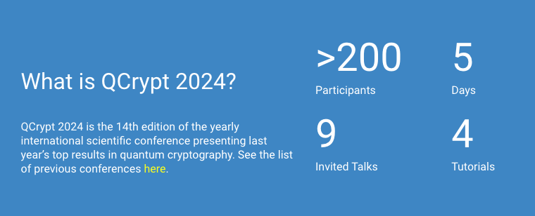
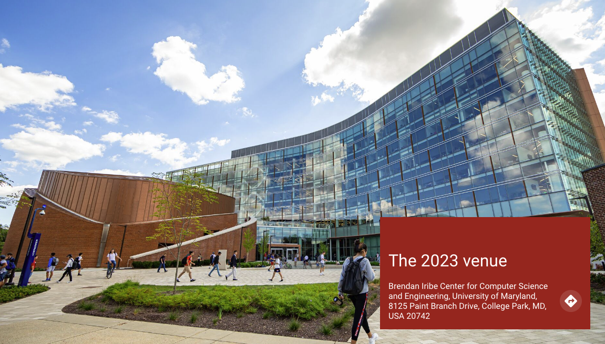
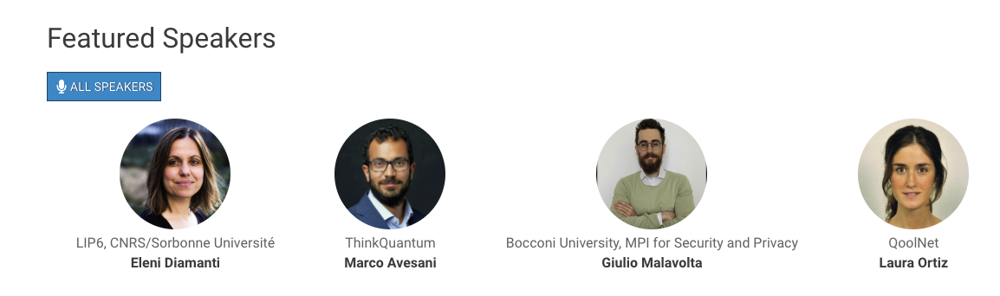
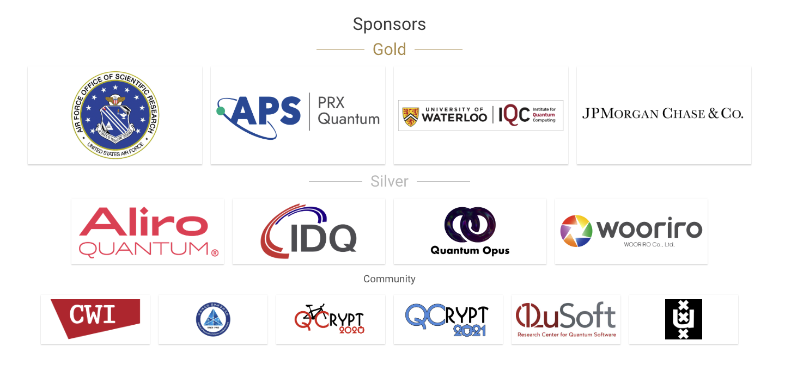
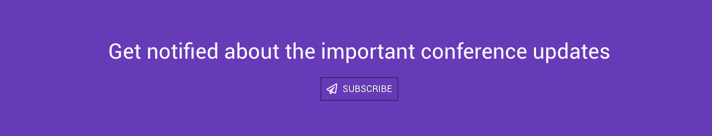
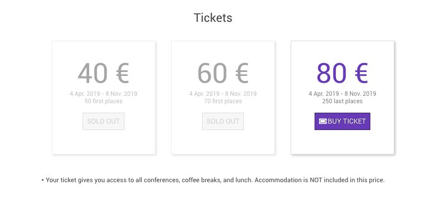
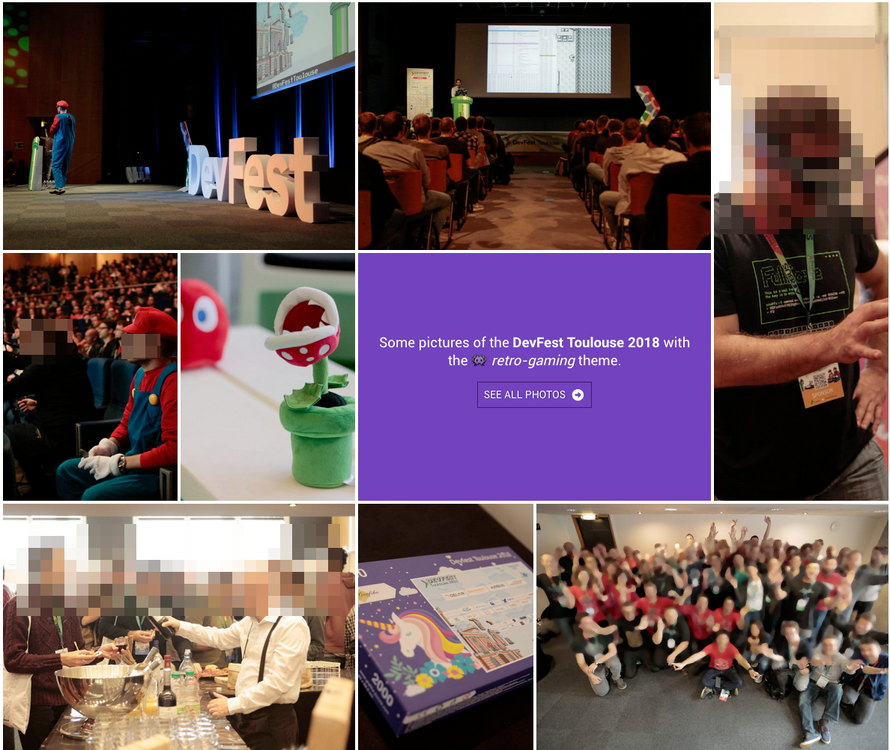

# DevFest Theme Hugo

The theme is located in the `/themes/devfest-theme-hugo/` subdirectory. It originated as an [independent theme](https://github.com/GDGToulouse/devfest-theme-hugo), as a separate git submodule, but since 2023, it's permanently included in the git repository.

> [!NOTE]
> The original multi-lingual support has been dropped, but reminders of it are still lingering around.

## Getting ready to edit the theme
> [!WARNING]
> This has only been tested on macOS so far, so sharing your experience with other platforms here is very appreciated!

Some version of `npm` might already be installed on your system, check which one with `$ npm --version`. If that works, you can run in the main `qip-website` folder
```bash
$ npm clean-install
```
to install the dependencies as specified in [package.json](/package.json). This will create a `node_modules` subfolder which should not be included in the git repository (that's why it's excluded in the [.gitignore](/.gitignore)).

This has installed the PostCSS features, so now you should be able to run
```bash
$ hugo build
```
which builds the whole site to the `/public` subfolder, which is also excluded from the git repository. You can always delete this whole folder (`$ rm -rf qip-website/public`) and rebuild it with the command above.

### Install Node.js
If you don't have `npm` already, install [Node.js](https://nodejs.org/en/download), in particular install `v22.12.0 (LTS)` for `macOS/linux/windows` using `nvm` with `npm`. `nvm` is a cross-platform Node.js version manager. 

Make sure you are using the latest `npm` version by
```bash
$ nvm use --lts
Now using node v22.12.0 (npm v10.9.0)
```

## A Guided Walk through the ingredients
Hugo is a static website generator. This means that it takes content files encoded in `.md` files and produces *static HTML* files that can be easily served by a webserver. In our case, [netlify](https://www.netlify.com/) takes care of that. When you run the `$ hugo build` command, this building process is executed and the resulting files are stored in the `/public` directory.

The HTML content mainly comes from the Markdown content files in [/content](/content). These files are organized in subfolders, starting with the year, and then further subdivisions.

The more data-type content (such as the list of accepted papers and posters, as well as the schedule) is provided from YAML and JSON files in [/data](/data). The data files for the list of accepted papers and posters can be exported (by the PC chair) from the [HotCRP](https://hotcrp.com/) submission handling system. These files should then be [sanitized](../../README.md#accepted-papers-and-posters-are-known) before adding them to the repository. The schedule needs to be created manually.

[Hugo templates](https://gohugo.io/templates/introduction/) make the content appear in a structured way. The templates are all in [/themes/devfest-theme-hugo/layouts](/themes/devfest-theme-hugo/layouts). It takes a while to figure out which template is used to create particular content.
* The basis is [baseof.html](/themes/devfest-theme-hugo/layouts/_default/baseof.html). It's quite instructive to try to understand its structure. It uses various others [partial templates](/themes/devfest-theme-hugo/layouts/partials), it defines *blocks* like "header", "banner", "main" that contain some content, but which might be overwritten by other templates later on. 
* An interesting partial template is [head.html](/themes/devfest-theme-hugo/layouts/partials/head.html) which defined the `<head>` section of the site, including various parameters, icons, RSS, CSS etc.
* [css.html](/themes/devfest-theme-hugo/layouts/partials/css.html) is using [Hugo Pipes](https://gohugo.io/hugo-pipes/introduction/) to create a CSS file `css/style-YEAR.css` from the SASS template `style/theme-YEAR.scss` (e.g. [theme-2027.scss](/themes/devfest-theme-hugo/assets/style/theme-2027.scss)). When using `hugo server` the file is immediately served and used, when running `hugo build`, the style file is stored in `css/style-YEAR.css` and served from there.
* An interesting partial template is [header.html](/themes/devfest-theme-hugo/layouts/partials/header.html), as it defines the menu structure, and retrieves the logo of the current year for the menu bar. 
* [footer.html](/themes/devfest-theme-hugo/layouts/partials/footer.html) displays the footer.
* [js.html](/themes/devfest-theme-hugo/layouts/partials/js.html) is the partial template inserted at the end of the [header.html](/themes/devfest-theme-hugo/layouts/partials/header.html). It uses the [Hugo JS functions](https://gohugo.io/functions/js/) to create one `main.js` file which is then included as `<script>`
* `icon.html` is an identical [shortcode](/themes/devfest-theme-hugo/layouts/shortcodes/icon.html) and [partial template](/themes/devfest-theme-hugo/layouts/partials/icon.html) to display icons from ['assets/icons'](/themes/devfest-theme-hugo/assets/icons). If you need another icon, try adding it to this folder!

Besides the HTML, the site needs CSS and JavaScript to run and be displayed properly. These assets are provided in:
- `assets/icons/` - Icon assets
- `assets/style/` - SCSS source files
- `assets/script/` - JavaScript source files


### SASS
SASS (Syntactically Awesome Style Sheets) is a preprocessor scripting language that is compiled into CSS. It provides features like variables, nested rules, mixins, and functions, making CSS maintenance more efficient. In our theme, SASS files are processed through Hugo Pipes, which compiles them into regular CSS files during the build process. The main entry point is `theme-YEAR.scss`, which imports various partial SCSS files to create a modular and maintainable stylesheet structure.
For example, the [theme-2027.scss](/themes/devfest-theme-hugo/assets/style/theme-2027.scss) file serves as the main stylesheet for the 2027 website, importing various partial SCSS files to build the complete CSS. This modular approach helps in organizing styles into manageable and reusable components, making the codebase easier to maintain and extend. The file also defines a root-level custom property for the primary color, ensuring consistent use of the color throughout the website.

This primary color is the main (and so far only) difference between the styles of the different years, but more variables of [_root.scss](/themes/devfest-theme-hugo/assets/style/_root.scss) could be included in the distinction in the future.

When running the local hugo server, the `enableSourceMap` and `sourceMapContents` options are [turned on](/themes/devfest-theme-hugo/layouts/partials/css.html) (and no PostCSS and minification happen), so that the developer console in the browser should refer to the `.scss` files that were used.

The [sass-mq](/themes/devfest-theme-hugo/assets/style/sass-mq/) mixin is directly included as sub-directory in the assets. It helps styling the page for smaller screens like mobile phones. It is used frequently througout the SASS code. See [its documentation](https://github.com/sass-mq/sass-mq). Including the line
```sass
  $show-breakpoints: $show-breakpoints
```
in [_variables.scss](/themes/devfest-theme-hugo/assets/style/_variables.scss) will display the currently active breakpoints in the top right corner.

Check [these tips](#debugging-sass) for debugging the SASS part.

## Theme Structure 
The Devfest Hugo theme follows a standard Hugo theme structure with the following main directories and files:

### Root Directories
- `archetypes/` - Contains default content templates
- `assets/` - Contains all processed resources (CSS, JS, images)
- `layouts/` - Contains all template files
- `images/` - Contains image files for this README
- `i18n/` - Contains translation files

### Key Layout Components
- `layouts/_default/` - Base templates
- `layouts/partials/` - Reusable template parts
- `layouts/shortcodes/` - Custom Hugo shortcodes
- `layouts/404.html` - Custom 404 error page

### Asset Organization
- `assets/style/` - SCSS source files
- `assets/script/` - JavaScript source files
- `assets/icons/` - Icon assets

### Configuration
- `theme.toml` - Theme metadata


## Site parameters

Parameters are mostly set in [hugo.toml](../../hugo.toml)

```toml
#...
baseURL = "https://qipconference.org/"
languageCode = "en"
title = "QIP Conference Website"

# Theme
theme = "devfest-theme-hugo"

# Params
enableEmoji = true
enableRobotsTXT = true
enableMissingTranslationPlaceholders = true

[services]
  [services.googleAnalytics]
    id = "G-221GMGECQ6"

[params]
    title = "QIP Conference Website"
    date = "2027-01-10"
    currentYear = 2027
    description = "International Conference on Quantum Information Processing (QIP)"
    images = ["/images/social-share.jpg"]
    email = "info@qip2027.org"
    keywords = "event, quantum computation, communication, cryptography, QIP"
    copyright = "We :heart: quantum"
    copyright_link = "https://github.com/IAQI/qip-website"
    # cfpUrl = "/2027/call"
    # subscriptionUrl = ""
    appleTouchIcon = "/apple-touch-icon.png"
    favicon32 = "/favicon-32x32.png"
    favicon16 = "/favicon-16x16.png"
    manifest = "/site.webmanifest"
    # safariPinnedTab = "/safari-pinned-tab.svg"

[params.2027]
  city = "Singapore"
  timeanddate_cityid = 236
  themeColor = "#0bb3db"
  [params.2027.logos]
    jumbo = "/images/2027/qip2027-home-banner.jpg"
    header = "/images/2027/qip2027-logo.png"
    banner = "/images/2027/qip2027-banner-inside-pages.jpg"

[params.logos]
    footer = "/images/logos/netlify-color-accent.svg"
    footer_link = "https://www.netlify.com"

[server]
  [[server.redirects]]
      from = "/"
      to = "/2027/"
      status = 302
      force = true 

[menu]
  [[menu.2027]]
    name = "Home"
    weight = 1
    identifier = "home"
    pageRef = '/2027'

  [[menu.2027]]
    name = "About"
    weight = 50
    identifier = "about"
    pageRef = '/2027'

  [[menu.2027]]
    name = "Sponsors"
    weight = 30
    identifier = "sponsors"
    pageRef = "/2027/partners"

  [[menu.2027]]
    name = "Committees"
    weight = 40
    identifier = "committees"
    pageRef = "/2027/team"


[languages]
[languages.en]
    weight = 1
    languageName = "us"

#...
```

### Header

The top navigation bar is build with

* Site title
* Site parameter `logos.header` for the logo, specified per year in [hugo.toml](../../hugo.toml)
* Menu `main`

### Footer

The footer is build with

* Site title
* Site params `email`, `subscriptionUrl`, `logos.footer`, `copyright`
* data from `data/footer.yml`

```yml
#share:
#  - name: facebook
#    url: https://www.facebook.com/sharer.php?u=
#  - name: twitter
#    url: https://twitter.com/intent/tweet?text=

follow:
  - name: twitter
    url: https://x.com/QIPConference
  - name: youtube
    url: https://www.youtube.com/@QIPconferencevideos

content:
  - title: footer_about
    links:
      - nameKey: footer_charter
        name: QIP Charter
        url: /charter/
        newTab: false
      - nameKey: footer_history
        name: QIP History
        url: /history/
        newTab: false
      - nameKey: footer_coc
        name: QIP Code of Conduct
        url: /code-of-conduct/
        newTab: false
```

There are also quite some more options in the original tempalate that we are currently not using.

The `url` in the links of `footer_about` is prepended with the `.Params.currentYear`, so that the footer always point to these documents of the current year.


### Home

The Home page is build with markdown and calling some shortcodes like `jumbo`, `button-link`, `home-info` etc..

#### Jumbo bloc

```hugo
{}

<p style="margin-bottom: 4rem;">
20-26 February 2027
</p>


{}
```


#### Info block

With main description and key figures.

```hugo
{}
## What is QIP 2027?

QIP 2027 is the 30th edition of the yearly international scientific conference on Quantum Information Processing. See the list of previous conferences <a href="https://qip.iaqi.org/previousqips">here</a>.
{}
```



#### key dates
Define the two important tables with key dates and website updates.

```hugo
{}

{}
|Date |Event|
|:----|:----|
|28 Sep 2026 | Talk registration deadline |
|5 Oct 2026 | Talk submission deadline |
|30 Nov 2026 | Decision notification for talks |
|4 Dec 2026 | Poster submission deadline |
|20 - 26 Feb 2027 | QIP 2027 |
{}

{}
|Date |Event|
|:----|:----|
|<DATE> | Add conference news or website updates here.|
{}

{}
```

If there is enough space, the tables are displayed next to each other.

#### Location block

Show conference location.

```hugo
{}

## The 2027 venue

The 2027 conference is organized by the Centre for Quantum Technologies in Singapore.

{}
```




#### Feature speakers block 

Just present your feature speakers

```hugo
{}
## Featured Speakers

{}
```



### Partners block

Show your partners

```hugo
{}
## Sponsors
{}
```




### Blocks currently not used
We are currently not using these blocks, but they could be reactived when needed.


#### Subscription block (not used)

Call to subscribe

Use the site param `subscriptionUrl`.

```hugo
{}

## Get notified about the important conference updates

{}
```




#### Ticket block (not used)

Display ticket information.

```hugo
{}
# Tickets

<ul>  
<li></li>
<li></li>
<li></li>
</ul>

\* Your ticket gives you access to all conferences, coffee breaks, and lunch. Accommodation is NOT included in this price.

{}
```




#### Album block (not used)

```hugo
{}

### Some pictures of the **DevFest Toulouse 2018** with the 👾 _retro-gaming_ theme.

<a class="btn primary" target="_blank" rel="noopener" href="https://photos.app.goo.gl/nJYFVReFUk9mnXbv9">
    See all photos
    {}
</a>

{}
```




### Partners

A partner should have these parameters:

```yaml
---
title: Centre for Quantum Technologies
type: partner
year: 2027
draft: false
category: community
logo: /2027/partners/logos/CQT-simplified.png
website: https://www.cqt.sg/
socials: []
---
```

### Speakers

A speaker should have these parameters:

```yaml
key: eisert
name: Jens Eisert
surname: Eisert
year: 2027
company: FU Berlin
photoURL: /2027/speakers/images/eisert.jpg
type: invited
website: '/2027/sessions/invited_eisert'
---
```

`surname` is used for sorting speakers.

> [!WARNING]
> The bio of the speaker should be put into the description of the session, like on [this example](/2027/sessions/invited_eisert/). There are **no individual speaker pages!**


additional parameters we are not using:
```yaml
id: jane_doe
featured: false
photo: /images/speakers/jane_doe.jpg
socials:
  - icon: twitter
    link: 'https://twitter.com/jane_doe'
    name: '@jane_doe'
  - icon: github
    link: 'https://github.com/jane_doe'
    name: jane_doe
shortBio: "Short bio"
companyLogo: /images/speakers/company/company.jpg
country: 'City, Country'
```
The body of the file is used as long bio.


### Sessions
A session should have these parameters:

```yaml
---
title: "Invited Talk: Potential and Limitations of Near-Term Quantum Computing"
speakers:
  - eisert
draft: false
format: invited
type: sessions
year: 2027
presentation: null
---
## Bio
**Yael Tauman Kalai** is a Senior Principal Researcher at Microsoft Research and Adjunct Professor at the Massachusetts Institute of Technology (MIT). Kalai earned a B.Sc in Mathematics from the Hebrew University of Jerusalem, an MS in Computer Science and Applied Mathematics from The Weizmann Institute of Science, and a Ph.D. in Computer Science from MIT.

## Abstract
In this talk I will discuss when we can "lift" classical reductions to post-quantum ones in a constructive manner...
```


not used are
```yaml
id: an_id
language: Français
complexity: Beginner
tags:
  - Category
speakers:
  - speaker id
talkType: Keynote
```
The body of the file is used as description.

### Team

A team member should have these params:
```yaml
---
title: Marco Tomamichel
surname: Tomamichel
type: core
year: 2027
subtitle: National University of Singapore
job: General chair
photoURL: /2027/team/images/marco-tomamichel.jpg
socials:
  - link: 'https://quics.umd.edu/people/gorjan-alagic'
    name: Site
---
```

### Schedule
Schedule data per year is in `/data/schedule-YEAR.yml`, for example:

```yml
- day: '2026-01-24'
  sessions:
    - session: __registration
      time: '08:30'
      location: house_of_science
    - session: tutorial_lami
      time: '09:30'
      location: alfa
    - session: __coffee_break
      time: '11:00'
      location: delta_omega
    - session: tutorial_lami
      time: '11:30'
      location: alfa
    - session: __endofday
      time: '20:00'
```

The `session` field refers to the `.md` content file in `/YEAR/sessions/`.
The `time` field is the start time of the session.

> [!NOTE]
> When displaying a single session like [this one](/2027/sessions/invited_eisert/), the start and end time are inferred from the schedule. In particular, the **end time** is the start time of the next event. Therefore, it's wise to include a `__endofday` event in the schedule of every day.


### Charter, History, Code of Conduct, other pages
just classic markdown files. 


### Blog (not used)
A blog should have these params:

```yaml
title: Title
brief: Short brief
image: /images/blog/photo.jpeg
date: 2019-01-20
draft: false
```

And of course, the body is the blog post.

## Debugging and Developing
Editing the theme can be tricky at times. 

### Which template?
Hugo's [template lookup order](https://gohugo.io/templates/lookup-order/) is not straightforward, so often it's not fully clear which template is actually used to display the current page. Therefore, when the local `hugo server` is run, some additional debug information is displayed on the page, often clarifying which template is used, and some additional information about the context.

This information is not displayed in a production environment, so don't worry about it.

```hugo
{{ if hugo.IsProduction | not }}
  <div style="background: #f0f0f0; padding: 10px; margin: 10px; font-family: monospace; font-size: 12px;">
    <details>
      <summary>Debug Info from baseof.html </summary>
      <pre>
  Page Kind: {{ .Kind }}
  RelPermalink: {{ .RelPermalink }}
  Anchorized RelPermalink: {{ anchorize .RelPermalink }}
  Section: {{ .Section }}
  Section Type: {{ printf "%T" .Section }}
  Section Type: {{ len .Section }}
  Section empty? {{ eq .Section "" }}
  Type: {{ .Type }}
  Layout: {{ .Layout }}
  Current Section: {{ .CurrentSection }}
  Parent Section: {{ .CurrentSection.Parent }}
  Params.currentYear: {{ .Site.Params.currentYear }}
  Current Year: {{ $currentYear }}
      </pre>
    </details>
  </div>
{{ end }}
```

### Debugging Hugo Pipes
[Hugo Pipes](https://gohugo.io/hugo-pipes/introduction/) is Hugo's asset processing for creating CSS from SASS, to run PostCSS, minify resources etc.

For debugging, various `warnf` messages are ready to be un-commented in the crucial [css.html](/themes/devfest-theme-hugo/layouts/partials/css.html), [js.html](/themes/devfest-theme-hugo/layouts/partials/js.html) and [icon.html](/themes/devfest-theme-hugo/layouts/shortcodes/icon.html) files.

### Debugging SASS
For testing and debugging purposes, you can also build the `css` outside of Hugo. Make sure you have [Dart Sass](https://gohugo.io/hugo-pipes/transpile-sass-to-css/) installed. Then run the following in the `qip-website` main folder
```bash
$ sass themes/devfest-theme-hugo/assets/style/theme-2027.scss themes/devfest-theme-hugo/assets/style/theme-2027.css
```
This might show you more detailed error messages.


## License
MIT, see [LICENSE](https://github.com/jweslley/hugo-conference/blob/master/LICENSE).
